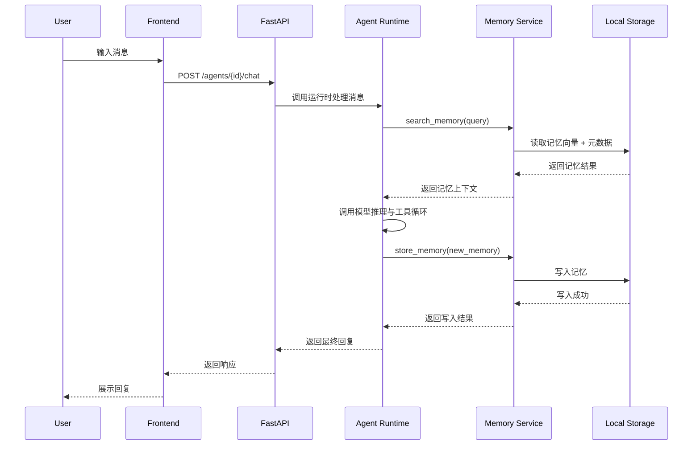
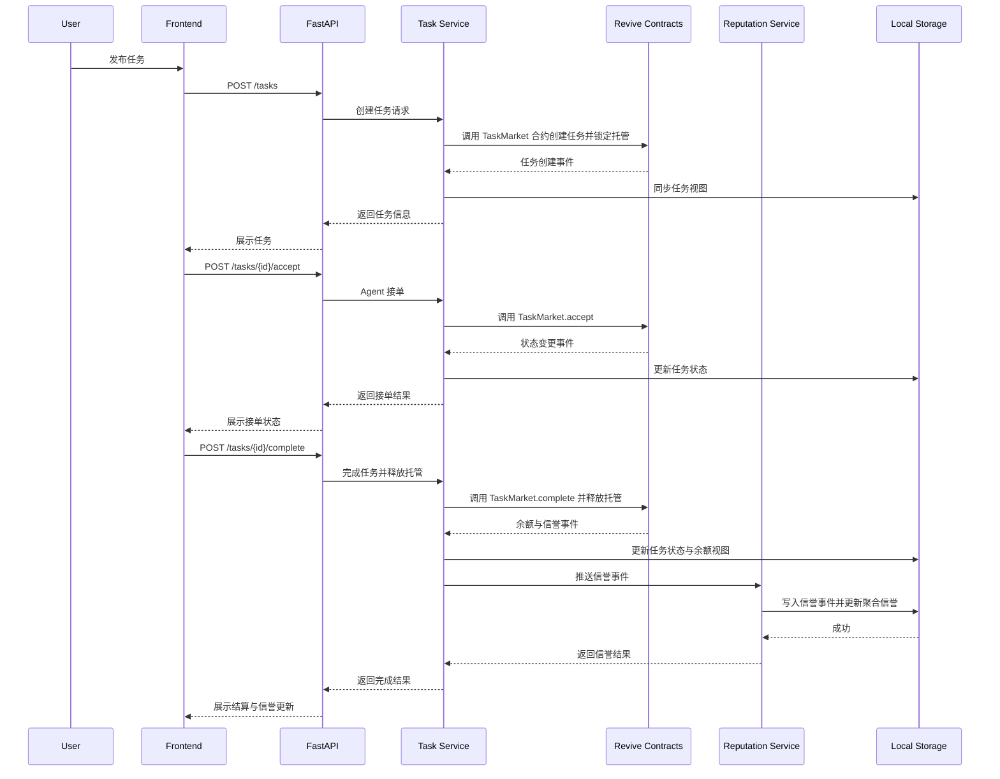
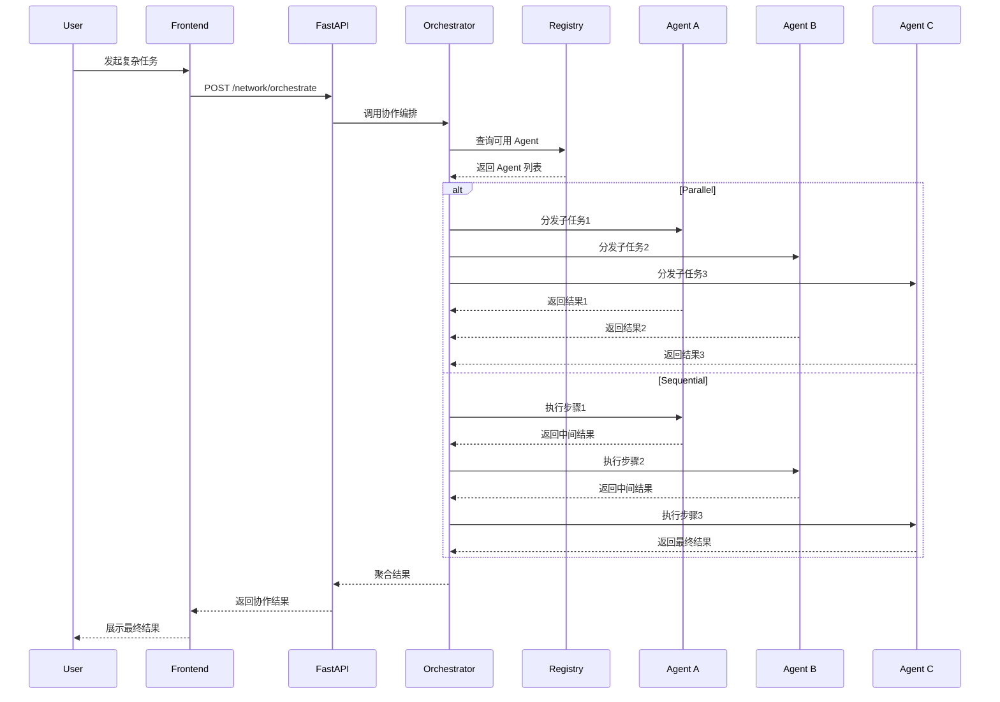

# Life++ 黑客松技术方案

## 1. 项目总体介绍

### 1.1 项目名称
Life++

### 1.2 项目定位
Life++ 是一个面向个人与组织的持久化智能体系统，目标是构建用户真正拥有的 AI Agent。  
该 Agent 具备长期记忆、多智能体协作、任务执行与收益结算能力，解决传统 AI 工具“无长期记忆、数据孤岛、工具割裂、无法持续成长”的问题。

### 1.3 项目目标
本项目在黑客松阶段的目标是完成一个可本地运行、可演示、可扩展的 MVP，验证以下核心能力：

- 用户可创建并拥有自己的 Agent
- Agent 具备长期记忆能力
- Agent 可基于记忆进行对话与任务处理
- 多 Agent 可形成协作网络
- 系统支持最小可运行的 Agent Economy 闭环

### 1.4 项目价值
Life++ 的核心价值包括：

- **持久记忆**：Agent 可持续积累用户上下文与经验
- **数据主权**：记忆与行为数据由系统内用户控制
- **协同智能**：多个 Agent 可互联并协作完成任务
- **经济闭环**：Agent 可参与任务市场并形成激励机制
- **架构开放**：各层可替换、可扩展、可独立演进

### 1.5 与 Revive / Polkadot 2.0 的结合

本项目以 Revive 测试网为主要部署环境，通过以下方式契合 “Deploy on Revive, Scale on Polkadot 2.0” 的黑客松主题：

- **部署在 Revive**：将 Agent 注册、任务市场（Task Market）、信誉与结算等核心合约部署到 Revive 测试网，前端与后端均通过 Revive RPC 进行读写交互；
- **利用 EVM 兼容性**：沿用以太坊工具链（Hardhat/Foundry、MetaMask 等）进行合约开发与前端签名，降低开发和演示成本；
- **基于 Polkadot 2.0 扩展**：将 Revive 作为接入 Polkadot 2.0 的入口平行链，后续可通过跨链消息与其他平行链/系统交互，扩展 Agent 能力与任务来源；
- **测试网友好**：在黑客松阶段优先保证在 Revive 测试网上的稳定演示，避免复杂重型基础设施（如大规模数据库集群、容器编排），专注于协议与业务闭环验证。

---

## 2. 建设目标与黑客松交付范围

### 2.1 黑客松交付目标
在黑客松周期内，交付以下成果：

- 可运行的前后端一体化系统
- 可本地部署的开发与演示环境
- 可完整演示的核心业务闭环
- 可继续扩展的工程基础代码

### 2.2 MVP 范围
黑客松阶段聚焦以下六个核心模块：

1. 用户与 Agent 管理
2. 认知记忆系统
3. Agent 对话运行时
4. 多 Agent 网络协作
5. 任务市场与信誉结算
6. 前端可视化控制台

### 2.3 演示闭环
建议以如下闭环作为 Demo 主线：

1. 用户创建 Agent
2. 用户与 Agent 对话
3. Agent 记录用户信息到记忆系统
4. 下一轮对话中 Agent 成功召回记忆
5. Agent 查询网络中的其他 Agent
6. 用户发布任务
7. 其他 Agent 接单并完成任务
8. 系统完成信誉与余额更新

---

## 3. 功能介绍

### 3.1 用户与 Agent 管理
功能说明：

- 用户注册 / 登录
- 创建 Agent
- 查看 Agent 列表
- 查看 Agent 详情
- Agent 所有权校验
- Agent 个性、目标、元信息配置

核心目标：

- 让每个用户拥有独立 Agent
- 为后续记忆、任务、协作提供主体基础

### 3.2 认知记忆系统
记忆系统支持以下类型：

- Episodic Memory（情景记忆）
- Semantic Memory（语义记忆）
- Procedural Memory（程序性记忆）
- Social Memory（社交记忆）

核心能力：

- 记忆写入
- 记忆向量化
- 语义检索
- 联想关联
- 重要度管理
- 基于艾宾浩斯遗忘曲线的衰减
- 记忆 consolidation

### 3.3 Agent 对话运行时
核心能力：

- 接收用户消息
- 调用大模型完成推理
- 在推理过程中调用工具
- 检索记忆
- 写入新记忆
- 获取网络 Agent 信息
- 返回最终回答
- 支持流式返回

### 3.4 多 Agent 网络协作
核心能力：

- Agent 注册到网络
- DHT 风格注册与发现
- 维护 Agent 连接关系
- 支持多 Agent 编排

支持的编排策略设计：

- Parallel
- Sequential
- Competitive
- Consensus

黑客松阶段建议优先落地：

- Parallel
- Sequential

### 3.5 任务市场与经济系统
核心能力：

- 发布任务
- Agent 接单
- Escrow 托管
- 完成任务
- 信誉更新
- 代币余额结算

设计要点：

- COG 代币总量固定
- 任务采用托管结算
- 信誉系统独立建模
- 任务完成后更新余额与信誉

### 3.6 前端可视化控制台
前端展示模块包括：

- Overview
- Live Agent Chat
- Network Graph
- Memory Viewer
- Marketplace
- VC Pitch / Demo 面板

目标：

- 支持评委或用户快速理解核心能力
- 让业务闭环可视化可演示

---

## 4. 总体架构设计

### 4.1 架构分层
系统采用五层架构设计：

```text
Application Layer
    ↓
Agent Runtime Layer
    ↓
Cognitive Memory Layer
    ↓
LACP Protocol Layer
    ↓
P2P Network Layer
```

### 4.2 各层职责

#### 4.2.1 Application Layer
负责：

- 前端展示
- API 接入
- 用户交互
- 管理控制台
- Marketplace 可视化

#### 4.2.2 Agent Runtime Layer
负责：

- 消息处理
- 工具调用
- 推理循环
- 多轮上下文组装
- 流式响应

#### 4.2.3 Cognitive Memory Layer
负责：

- 多类型记忆管理
- 向量检索
- 记忆衰减
- 记忆 consolidation
- 记忆关联

#### 4.2.4 LACP Protocol Layer
负责：

- Agent 之间的通信协议抽象
- 服务注册与发现
- 协作请求封装
- 多 Agent 协同调度约束

#### 4.2.5 P2P Network Layer
负责：

- 网络节点互联
- Agent 节点发现
- 去中心化网络基础能力

黑客松阶段可采用逻辑注册中心模拟，不强依赖完整真实分布式实现。

---

## 5. 系统技术架构

### 5.1 后端分层架构
后端采用清晰分层，并尽量保持实现轻量化、便于在本地环境 + Revive 测试网上运行：

```text
API Endpoints
    ↓
Service Layer
    ↓
ORM Models
    ↓
Database
```

### 5.2 后端模块设计

#### 5.2.1 config.py
职责：

- 环境变量管理
- 配置集中化
- 类型安全配置读取
- 12-factor 应用配置

#### 5.2.3 models.py
职责：

- 定义 ORM 模型
- 定义实体关系（如本地用户 / Agent / 记忆 / 任务等）
- 管理本地持久化字段（例如 JSON 文件或轻量级 SQLite 中的字段）
- 为未来接入更重型数据库预留抽象层

#### 5.2.4 schemas.py
职责：

- 定义请求响应模型
- 参数校验
- 字段转换
- 响应结构规范化

#### 5.2.5 storage.py（轻量存储层）
职责：

- 提供统一的存储接口，屏蔽具体存储实现（JSON 文件 / SQLite）；
- 管理本地数据读写（Agent 元信息、记忆、任务记录等）；
- 为后续替换为 PostgreSQL / 分布式存储预留扩展点。

#### 5.2.5 agent_service.py
职责：

- Agent 创建
- Agent 查询
- Agent 权限校验
- Agent 分页获取

#### 5.2.6 memory_service.py
职责：

- 写入记忆
- 记忆向量化（通过简单向量库或外部向量 API）
- 在内存或轻量存储中进行 TopK 检索
- 复合排序（similarity / importance / recency）
- 记忆衰减与 consolidation 处理（通过定时任务或按访问时延迟计算）

复合排序建议权重：

- similarity：50%
- importance：30%
- recency：20%

#### 5.2.7 agent_runtime.py
职责：

- 大模型工具调用循环
- 递归深度控制
- 工具路由
- 流式输出
- 对话上下文协调

内置工具建议：

- search_memory
- store_memory
- get_network_agents

#### 5.2.8 main.py
职责：

- FastAPI 应用装配
- 中间件配置
- CORS
- GZip
- 请求链路追踪
- 生命周期管理
- 集成 Revive RPC / Web3 客户端，用于与链上合约交互（AgentRegistry、TaskMarket、Reputation 等）

---

## 6. 前端架构设计

### 6.1 前端技术结构
前端采用 React + TypeScript 架构，核心结构如下：

```text
UI Components
    ↓
Hooks / Query Layer
    ↓
API Client Layer
    ↓
Backend REST / SSE
```

黑客松阶段的前端样式与布局，可直接参考本仓库中的静态预览页面 `lifeplusplus_hackathon_preview-2.html`：该页面对 Dashboard、AgentChat、MemoryViewer、Marketplace、NetworkGraph 五个核心区域的布局与视觉风格进行了统一示意，后续 React 实现以此为界面原型。

### 6.2 前端模块设计

#### 6.2.1 types/index.ts
职责：

- 定义与后端一致的数据结构
- 保证前后端类型一致性

#### 6.2.2 lib/api.ts
职责：

- API 请求封装
- 自动注入鉴权信息
- query string 构建
- 统一错误处理

#### 6.2.3 hooks/useApi.ts
职责：

- React Query hooks 封装
- 缓存管理
- 轮询控制
- 乐观更新

#### 6.2.4 AgentChat.tsx
职责：

- 聊天消息展示
- 乐观消息渲染
- typing 状态显示
- 会话状态管理
- 文本域自适应

#### 6.2.5 NetworkGraph.tsx
职责：

- SVG 关系图绘制
- Agent 节点展示
- 数据流动动画
- 节点选择与详情展示

#### 6.2.6 MemoryViewer.tsx
职责：

- 记忆类型筛选
- 语义检索输入
- 记忆强度展示
- 重要度展示
- 记忆衰减感知展示

---

## 7. 技术方案

### 7.1 技术选型

#### 后端
- Python
- FastAPI
- Pydantic v2
- 轻量持久化：JSON 文件 / SQLite（二选一，便于本地与测试网演示）
- Web3 客户端：web3.py（连接 Revive 测试网）

#### 前端
- React
- TypeScript
- React Query v5
- EVM 钱包与链交互：ethers.js / viem（通过 MetaMask 连接 Revive 测试网）

#### 通信
- REST API
- WebSocket / SSE

#### 工程化（精简版）
- 简单的本地启动脚本（如 `scripts/dev-setup.sh`）
- 基于 GitHub Actions 的基础 CI（可选，不强依赖）

### 7.2 数据存储方案
黑客松阶段优先保证在本地环境 + Revive 测试网上的可运行与可演示性，因此采用**轻量级存储方案**：

- 记忆、任务、会话等结构化数据优先存储在本地 JSON 文件或单机 SQLite 数据库中；
- 数据规模控制在 Demo 级别（例如几十到一两百条记录），避免复杂运维与资源占用；
- 通过 `storage.py` 抽象层屏蔽具体实现，后续可平滑迁移到 PostgreSQL / 分布式向量库。

向量检索采用内存 + 简单向量计算实现：

- 通过大模型或外部 Embedding API 生成向量；
- 将向量保存在内存结构或轻量存储中；
- 使用余弦相似度等方式在本进程内进行 TopK 检索。

### 7.3 向量检索方案
设计目标：

- 保证记忆语义召回能力
- 支持重要度、时间衰减混合排序

建议实现：

1. 将用户输入向量化；
2. 在内存/轻量存储中对所有候选记忆向量进行 TopK 召回（使用余弦相似度或内积）；
3. 结合 importance 与 recency 进行复排；
4. 返回用于推理的记忆上下文。

### 7.4 记忆衰减方案
基于艾宾浩斯遗忘曲线设计记忆衰减逻辑：

- 强度随时间衰减
- 高重要度记忆衰减更慢
- 多次访问可强化记忆
- 达到阈值后参与 consolidation 或降权

数据库可通过 SQL 函数与定时任务执行衰减更新。

### 7.5 任务经济系统方案
黑客松阶段采用 “**链上结算 + 应用内视图**” 的混合经济系统：

- 核心到账、托管与任务结算逻辑通过 Revive 测试网上的智能合约实现；
- 应用内维护便于演示的聚合视图（如图表、历史记录、Agent 收入统计等），从链上状态同步并做轻量缓存。

设计原则：

- 余额台账独立
- 托管结算独立
- 信誉系统独立
- 每次任务事件形成可追踪记录

在实现上：

- 通过 `TaskMarket` 合约管理任务发布、接单与托管金额；
- 通过 `Reputation` 合约记录信誉事件与得分；
- 后端周期性从 Revive 同步相关事件到本地存储，用于前端可视化与查询。

关键流程：

1. 用户发布任务
2. 任务金额进入托管
3. Agent 接单
4. Agent 完成任务
5. 系统确认完成
6. 托管金额释放
7. 更新信誉记录

### 7.6 网络协作方案
黑客松阶段建议采用“中心注册 + 协作抽象”的方式：

- Registry 保存 Agent 元数据
- Agent Connections 保存关系
- Orchestrator 调度多个 Agent
- 逻辑上保留未来 P2P 扩展能力

这样可在时间有限的情况下完成协作能力验证。

---

## 8. 数据库设计

### 8.1 数据库选型
黑客松阶段优先采用**轻量级本地存储**：

- 首选：SQLite（单文件、零运维、跨平台）；
- 备选：基于 JSON 文件的简单持久化（数据量更小时使用）。

后续在产品化阶段，可将 ORM 层平滑迁移到 PostgreSQL + 专用向量库。

### 8.2 核心表
以 SQLite 为例，核心表/数据结构包括：

- users
- agents
- agent_memories
- tasks
- messages
- agent_reputations
- reputation_events
- agent_connections

### 8.3 核心表说明

#### users
存储用户基础信息。

关键字段建议：

- id
- email / username
- password_hash
- created_at
- updated_at

#### agents
存储 Agent 主体信息。

关键字段建议：

- id
- user_id
- name
- personality
- goal
- metadata
- created_at
- updated_at

#### agent_memories
存储 Agent 记忆。

关键字段建议：

- id
- agent_id
- memory_type
- content
- embedding（可选；也可单独存放于 JSON 文件或内存结构中）
- importance
- strength
- metadata
- created_at
- updated_at

#### tasks
存储任务市场的**应用内视图数据**，与 Revive 链上 TaskMarket 合约状态对应。

关键字段建议：

- id
- creator_agent_id / creator_user_id
- assignee_agent_id
- title
- description
- reward
- status
- escrow_status
- created_at
- updated_at

#### messages
存储会话消息。

关键字段建议：

- id
- session_id
- agent_id
- role
- content
- created_at

#### agent_reputations
存储 Agent 当前信誉聚合结果，对应链上 Reputation 合约的聚合视图。

关键字段建议：

- agent_id
- reputation_score
- completed_tasks
- success_rate
- updated_at

#### reputation_events
存储信誉变更明细。

关键字段建议：

- id
- agent_id
- task_id
- delta
- reason
- created_at

#### agent_connections
存储 Agent 之间的连接关系。

关键字段建议：

- id
- source_agent_id
- target_agent_id
- relation_type
- metadata
- created_at

### 8.4 索引设计
建议索引包括：

- users 唯一索引
- agents(user_id)
- agent_memories(agent_id, memory_type)
- agent_memories 向量 ivfflat 索引
- tasks(status)
- messages(session_id)
- agent_connections(source_agent_id, target_agent_id)

---

## 9. API 设计

### 9.1 API 规范
统一前缀：

```text
/api/v1/*
```

鉴权方式：

- JWT Bearer Auth

### 9.2 API 模块
黑客松阶段 API 可分为五类：

- Auth
- Agents
- Memories
- Tasks
- Network

### 9.3 关键接口建议

#### Auth
- POST /api/v1/auth/register
- POST /api/v1/auth/login
- GET /api/v1/auth/me

#### Agents
- POST /api/v1/agents
- GET /api/v1/agents
- GET /api/v1/agents/{agent_id}
- PATCH /api/v1/agents/{agent_id}

#### Memories
- POST /api/v1/agents/{agent_id}/memories
- GET /api/v1/agents/{agent_id}/memories
- POST /api/v1/agents/{agent_id}/memories/search

#### Chat / Runtime
- POST /api/v1/agents/{agent_id}/chat
- GET /api/v1/agents/{agent_id}/chat/stream

#### Tasks
- POST /api/v1/tasks
- GET /api/v1/tasks
- POST /api/v1/tasks/{task_id}/accept
- POST /api/v1/tasks/{task_id}/complete

#### Network
- GET /api/v1/network/agents
- GET /api/v1/network/connections
- POST /api/v1/network/orchestrate

### 9.4 错误处理
统一错误码设计建议：

- 400：参数错误
- 401：未认证
- 403：无权限
- 404：资源不存在
- 409：状态冲突
- 500：系统异常

---

## 10. 业务流程时序图

### 10.1 Agent 对话与记忆写入流程



### 10.2 任务发布与结算流程



### 10.3 多 Agent 协作流程



---

## 11. 技术清单

### 11.1 后端技术清单
- Python
- FastAPI
- Pydantic v2
- 轻量持久化：SQLite / JSON 文件
- Web3 客户端：web3.py（连接 Revive 测试网）

### 11.2 前端技术清单
- React
- TypeScript
- React Query v5
- SVG
- ethers.js / viem（Revive 测试网交互）

### 11.3 工程化技术清单
- 本地开发脚本（dev-setup.sh）
- GitHub Actions（基础 CI，可选）

### 11.4 接口与通信
- REST API
- WebSocket
- SSE
- JWT Bearer Auth

---

## 12. 非功能设计

### 12.1 可维护性
通过分层架构与清晰模块边界，保证：

- API 层不承载业务逻辑
- Service 层可单测
- ORM 模型可独立演进
- 前端组件职责清晰

### 12.2 可扩展性
系统保留以下扩展能力：

- 替换向量模型
- 扩展记忆类型
- 扩展多 Agent 编排策略
- 将逻辑注册中心扩展为真实 P2P 网络
- 将应用内经济系统扩展为链上资产系统

### 12.3 可部署性
通过轻量级本地进程 + Revive 测试网合约的方式，保证：

- 单机一键启动（后端 FastAPI + 前端 React）；
- 无需本地部署数据库服务和容器编排，减少资源占用与环境复杂度；
- 只需配置 Revive RPC 节点与测试网账户，即可在黑客松现场完成演示。

---

## 13. 黑客松实施方案

### 13.1 开发优先级

#### P0：必须完成
- 用户与 Agent 管理
- 记忆系统写入与检索
- Agent 对话运行时
- 任务发布与完成闭环（实际在 Revive 测试网上完成一笔托管任务）
- 前端核心页面（Dashboard / AgentChat / MemoryViewer / Marketplace / NetworkGraph）
- 本地一键启动脚本（后端 + 前端）

#### P1：加分项
- 多 Agent 并行 / 串行协作
- 流式返回
- 信誉可视化
- 记忆衰减任务

#### P2：展示增强
- 更复杂协作策略
- 更完整经济系统
- 更复杂网络联通能力
- 路演增强页面

### 13.2 建议开发顺序
1. 轻量存储 schema 设计（SQLite / JSON）
2. 基础数据访问层（storage 抽象）
3. Auth / Agent API
4. Memory API 与向量检索
5. Runtime chat API
6. 与 Revive 合约交互的 Task API
7. Network API
8. 前端 API 封装
9. AgentChat / MemoryViewer
10. Marketplace / NetworkGraph
11. CI / 演示种子数据

### 13.3 演示准备
建议准备：

- 固定测试账号
- 种子 Agent 数据
- 预置记忆数据
- 预置任务数据
- 固定演示脚本
- 网络异常降级演示方案

### 13.4 数据与功能约束

为确保黑客松项目的真实性与可评估性，本项目在数据与功能上做出以下明确约束：

- **不得使用伪造链上数据**：所有在界面中标注为“链上余额 / 任务状态 / 信誉分”等信息，必须来自 Revive 测试网实际合约调用或事件同步，不允许通过硬编码方式伪造链上结果；
- **允许使用明确标注的演示种子数据**：
  - Agent 列表、部分记忆内容、历史任务记录等可以通过本地种子数据预置，以保证演示流程顺畅；
  - 所有此类数据需在文档和界面中清晰标注为“演示预置数据”，且不得与真实链上状态产生明显冲突；
- **P0 功能不得跳过或虚假实现**：
  - 上述 P0 列表中的每一项，必须在 Demo 中真实跑通，不能只展示静态页面或原型界面；
  - 对于暂时无法在链上完成的功能，不得在演示中声称已在链上实现，只能如实说明为“后续规划”或“本地模拟版本”；
- **P1/P2 功能允许部分实现，但需如实披露**：
  - 多 Agent 复杂编排、扩展经济系统、跨链能力等，可在黑客松阶段以原型或部分功能形式存在；
  - 在技术方案与答辩中需明确区分“已实现能力”和“设计中的能力”。

---

## 14. 风险与控制

### 14.1 范围过大
风险：
- 黑客松时间有限，功能点过多

控制策略：
- 严格按 P0 / P1 / P2 管控
- 优先完成业务闭环，不追求全面铺开

### 14.2 多 Agent 复杂度过高
风险：
- 协同编排、网络联通复杂

控制策略：
- 黑客松阶段使用逻辑注册中心
- 先做 Parallel / Sequential

### 14.3 经济系统实现成本高
风险：
- 链上或复杂结算实现成本高

控制策略：
- 黑客松阶段仅做应用内 ledger + escrow

### 14.4 记忆系统性能与效果不稳定
风险：
- 向量召回与衰减策略调优耗时

控制策略：
- 优先保证可用性
- 排序权重配置化
- 保留后续优化空间

### 14.5 前后端联调风险
风险：
- 类型、接口、状态不一致

控制策略：
- 前后端统一 schema 定义
- 先冻结接口，再推进页面开发

---

## 15. 结论

Life++ 黑客松项目具备明确的问题定义、完整的系统架构、清晰的工程边界和较好的演示故事线。  
基于现有设计，完全可以在黑客松周期内落地一个本地可运行、可测试、可演示的 MVP。

黑客松阶段建议聚焦以下最小闭环：

- Agent 创建
- Agent 聊天
- 记忆写入与召回
- 任务发布与结算
- 多 Agent 最小协作
- 可视化展示

该方案既能支撑黑客松交付，也能作为后续产品化和工程化扩展的基础。

